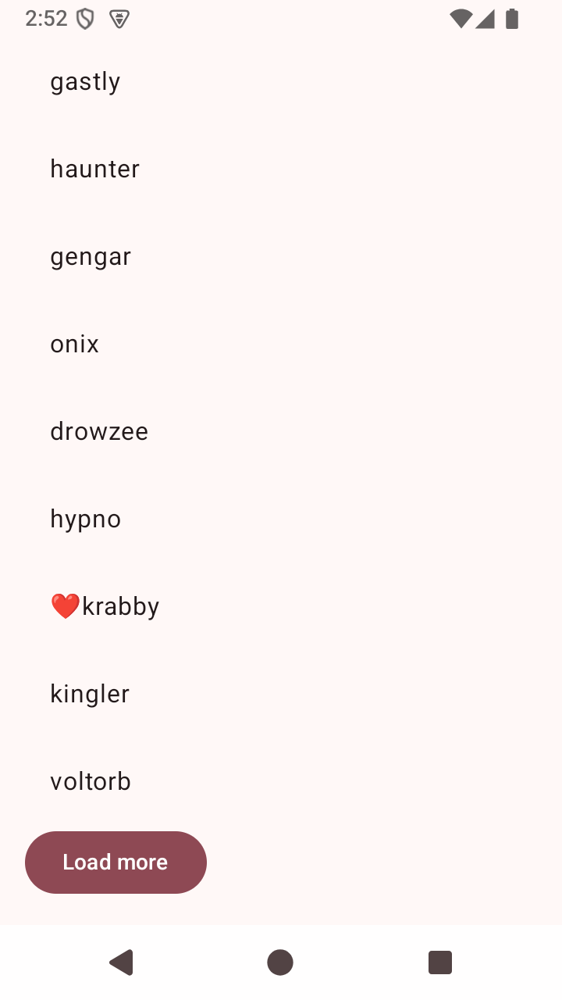
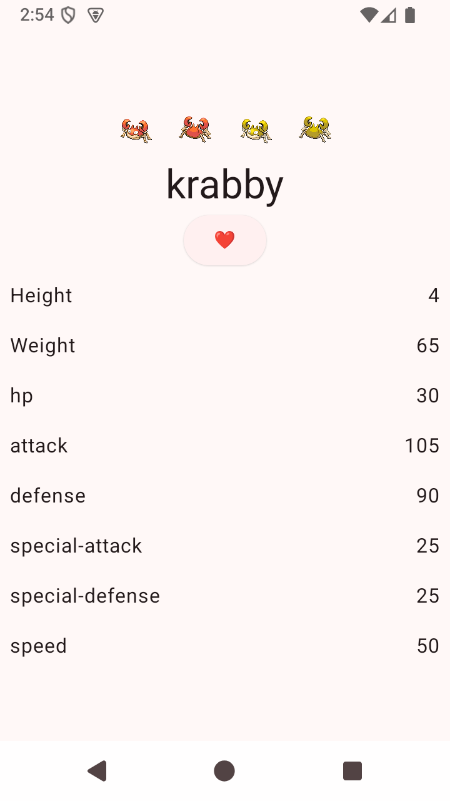
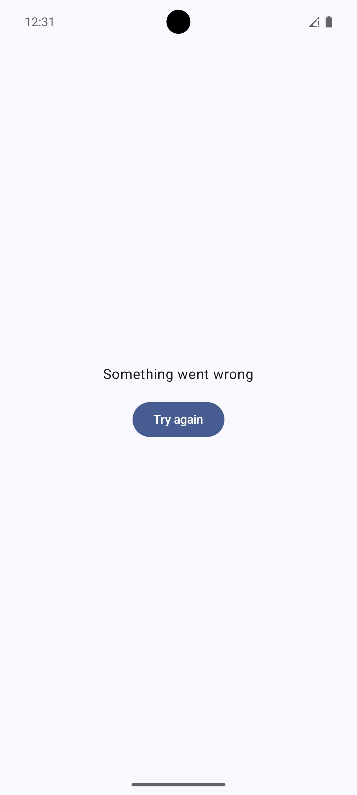
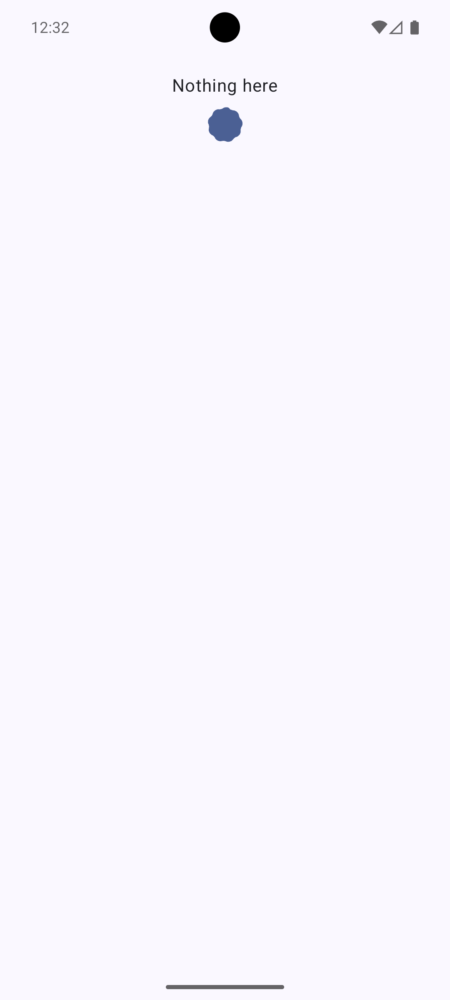
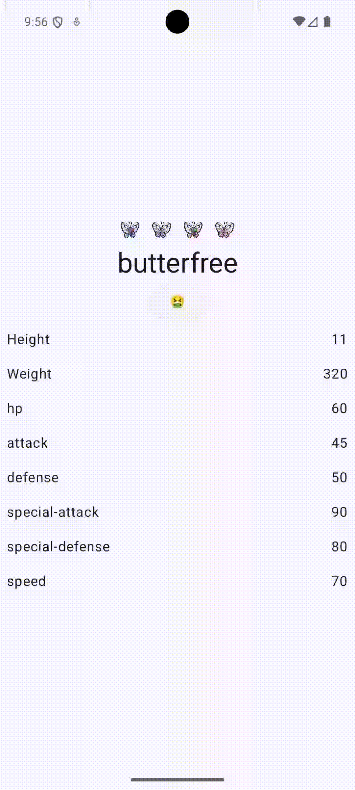

# Приложение PokeDex (приложение на PokeAPI)
#### Сценарий Room: Favorites (избранное сохраняется после перезапуска)
#### Как проверить сценарий: просматриваем карточку покемона - добавляем в избранное - перезапускаем приложение (избранный покемоны останутся помеченными)
#### UI состояния + проверка сценария Room на скриншотах ниже: 

## Домашнее задание 6 (Flow поверх проекта из ДЗ №4/5)

ФИО: Пейкова Анжелика Николаевна

Группа: Б9123-09.03.03пикд

### Реактивная композиция в `PokemonViewModel`

Состояние экрана списка собирается из **четырёх независимых источников** через `combine`:

1. `queryFlow: MutableStateFlow<String>` — текст поисковой строки (источник из UI)
2. `filterFlow: MutableStateFlow<FilterMode>` — режим фильтрации `All / FavoritesOnly` (источник из UI)
3. `pokeRepository.getFavorites(): Flow<Set<String>>` — избранное из `Room` (источник из data-слоя)
4. `refreshTrigger: MutableSharedFlow<Unit>` — поток действий пользователя `Refresh / Retry` (поток событий)

Дополнительно для экрана деталей используется отдельный `MutableSharedFlow<String>` — `detailRequests` — поток запросов на загрузку конкретного покемона.

### Использованные операторы Flow

- `combine` — объединение всех 4 источников в `UiState`
- `flatMapLatest` — на `refreshTrigger` для отмены устаревшего запроса списка и для `detailRequests` (новый запрос отменяет предыдущий)
- `debounce(300)` + `distinctUntilChanged` — на `queryFlow`, чтобы поиск по мере ввода не дёргал фильтрацию на каждый символ
- `onStart { emit(...) }` — для начальной автозагрузки и пустой строки поиска
- `stateIn(viewModelScope, WhileSubscribed(5000), UiState())` — превращает холодный поток в `StateFlow` с правильным жизненным циклом

### Уместность `StateFlow` и `SharedFlow`

- `StateFlow` — для длительного состояния, у которого всегда есть актуальное значение: `uiState`, `detailState`, `queryFlow`, `filterFlow`
- `SharedFlow` — для потоков **действий/триггеров**: `refreshTrigger` (Refresh/Retry), `detailRequests` (запрос на детальный экран). Не используется как one-shot event-bus

### Покрытие тестами

Unit-тесты `PokemonViewModelTest` (Flow-сценарии):

- `query is debounced and filters list by name` — три быстрых `setQuery` приводят к одному пересчёту после `debounce`
- `filter favorites only restricts list to favorites set` — переключение `FilterMode` пересобирает список через `combine`
- `favorites flow update is reflected in ui state without manual reload` — пуш в Room-Flow автоматически обновляет UI без ручного reload
- `favorites stateflow is independent from list subscription lifecycle` — Eagerly-поток избранного работает даже когда uiState отписан
- `refresh after error performs a new request and recovers` — `SharedFlow` действий + `flatMapLatest` корректно переигрывают загрузку
- `setFilterMode does not trigger a new network request` — фильтрация чисто реактивная, без походов в сеть
- `fetchPokemon stores details and exposes them via detailState` — отдельный `StateFlow` для деталей
- `detail retry for the same name triggers a fresh request` — повторный fetch того же имени реально перезапускает запрос
- `detailState exposes error when getPokemon fails` — ошибка в потоке деталей корректно отражается в state

Итого:

- `12` unit-тестов на `PokemonViewModel` (включая Flow-композицию, debounce, retry, error)
- `4` unit-теста на `PokeAPIRepository`
- `2` интеграционных теста `PokeAPIRepository` + Room
- `2` UI-интеграционных теста (навигация и retry)

## Домашнее задание 5

ФИО: Пейкова Анжелика Николаевна

Группа: Б9123-09.03.03пикд

Сколько сделано:

- `10` unit-тестов
- `4` интеграционных теста

Покрытые сценарии:

- успешная загрузка списка покемонов во `ViewModel`
- состояние `Loading`, пока запрос еще не завершен
- ошибка загрузки списка
- `retry()` после ошибки действительно запускает новый запрос и переводит экран в успешное состояние
- загрузка деталей покемона и сохранение их по нужному имени
- обновление `uiState.favorites` при новой эмиссии из `Flow`
- добавление покемона в избранное
- удаление покемона из избранного
- отсутствие дублей при преобразовании избранного в `Set<String>`
- корректное поведение новой подписки на поток избранного
- интеграция `Repository + Room`
- интеграция `Repository + Fake API + Room`
- UI-интеграция: список -> клик по элементу -> переход на детали нужного покемона
- UI-интеграция: ошибка -> нажатие `Retry` -> успешное состояние

Потоковые сценарии (`Flow`):

- тестируется полная последовательность эмиссий избранного: `empty -> setOf("pikachu", "bulbasaur") -> empty`
- тестируется нетривиальное потоковое поведение: новая подписка сразу получает актуальный снимок состояния
